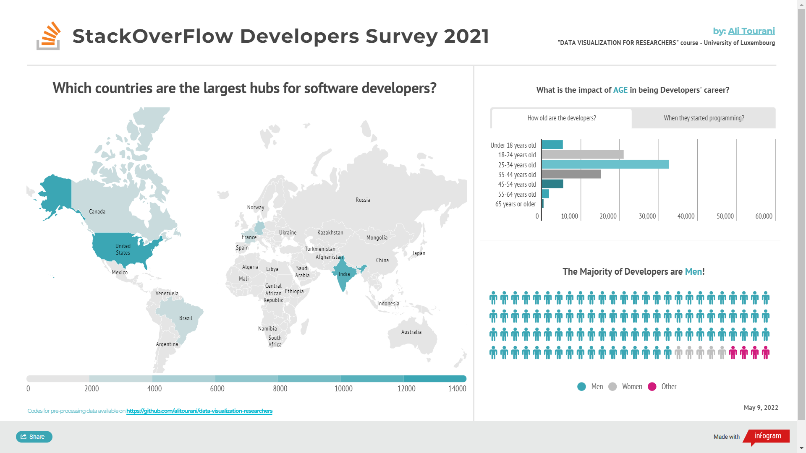

# StackOverFlow Developers Survey 2021

This repository contains the homeworks for the course "Data Visualization for Researchers" (University of Luxembourg - 2022 - [Dr. Koen Van den Eeckhout](https://www.koenvandeneeckhout.be/ "Dr. Koen Van den Eeckhout")).

[🔗 Link to the Interactive version](https://infogram.com/stackoverflow-developers-survey-1h7k230pxxn7g2x "Link to the Interactive version")

- Dataset by [StackOverFlow](https://insights.stackoverflow.com/survey "StackOverFlow")
- Made with [Infogram](https://infogram.com/ "Infogram")
- Ideas for choosing the chart by [ChartMaker](http://chartmaker.visualisingdata.com/ "ChartMaker")